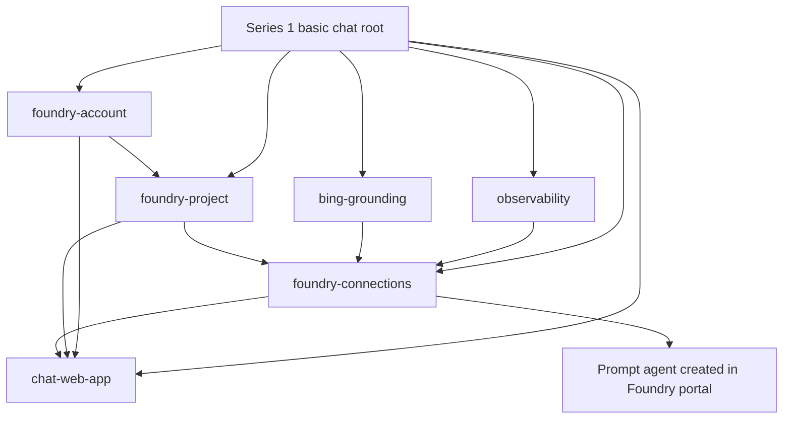

# Terraform Module Architecture

## Purpose and scope

This document describes the Terraform repository architecture for the ZimCanIT Microsoft Foundry series. The repository is a monorepo containing independently deployable environment root modules, composable local modules, architecture decisions, diagrams, and research assets.

Series 1 contains exactly one implementation environment: the basic Microsoft Foundry chat proof of concept. The module catalogue covers capabilities across the full repo, while future modules and environments remain unimplemented placeholders until their topics are developed. Empty architecture directories use `.gitkeep`. This architecture excludes GitHub Actions and CI pipeline files.

## Repository layout

```text
.
├── environments/
│   ├── README.md
│   └── series-1/
│       └── basic-chat/
│           ├── README.md
│           ├── backend.tf
│           ├── providers.tf
│           ├── main.tf
│           ├── variables.tf
│           ├── outputs.tf
│           ├── terraform.tfvars.example
│           └── .terraform.lock.hcl
├── modules/
│   ├── README.md
│   ├── foundry-account/
│   ├── foundry-project/
│   ├── foundry-connections/
│   ├── bing-grounding/
│   ├── chat-web-app/
│   ├── observability/
│   └── <future capability modules>/
├── docs/
│   ├── architecture/
│   ├── decisions/
│   └── terraform-module-architecture.md
├── research/
│   ├── benchmarks/
│   └── test-plans/
├── scripts/
├── .gitignore
├── LICENSE
└── README.md
```

`environments/` and `modules/` are separate on purpose. Each environment is a root module that owns a deployment and its state. Reusable modules expose a small interface and do not own state. The root module composes modules through inputs and outputs. Child modules do not call other child modules, keeping the composition and dependency order visible to the environment owner.

The module and environment catalogues describe intended capabilities. Empty capability directories are marked with `.gitkeep`; add Terraform configuration only when an in-scope implementation begins.

## Series and environment boundaries

A video does not automatically require a new Terraform environment. Create a separate root only when the video needs an independently deployable architecture, distinct lifecycle, or separate state boundary. Use documentation, scripts, or a focused code example for a topic that does not need its own Azure deployment.

| Content series | Environment boundary |
| --- | --- |
| Series 1: Microsoft Foundry Production Architecture | `environments/series-1/basic-chat` only. It reproduces the upstream basic chat proof of concept. |
| Series 2: Production AI Agents on Microsoft Foundry | Add roots for agent scenarios when required, such as a production agent platform or a hosted-agent workload. |
| Series 3: Securing Microsoft Foundry | Add roots for materially different security topologies, such as private Foundry with controlled egress. |
| Series 4: Operating Microsoft Foundry in Production | Add roots for independent operations labs where infrastructure is required, such as observability or resilience experiments. |
| Series 5: Microsoft Foundry Labs and Benchmarks | Prefer `research/` and application-level harnesses. Add an environment only when a repeatable Azure deployment is essential to the experiment. |

The Series 1 prompt agent is created through the Foundry portal in the upstream walkthrough. Its Terraform environment deploys the basic supporting infrastructure and project connections, and documents that manual agent step. It does not silently expand into the baseline architecture or hosted-agent infrastructure.

## Reusable module catalogue

Modules represent cohesive capabilities with a clear lifecycle, security boundary, and useful interface. They should not be split into one-resource wrappers solely to mirror the upstream Bicep files. The full target catalogue, including planned module names and series mapping, is maintained in [modules/README.md](../modules/README.md). Each catalogue directory is present with `.gitkeep`; its Terraform implementation is added only when an in-scope environment needs it.

The Series 1 root composes only these six capabilities:

| Module | Series 1 responsibility |
| --- | --- |
| `foundry-account` | Foundry resource, model deployment, account diagnostics, and required portal-user access. |
| `foundry-project` | Foundry project and project identity. |
| `foundry-connections` | Project connections to Bing Grounding and Application Insights. |
| `bing-grounding` | Bing Grounding resource used by the prompt agent. |
| `chat-web-app` | App Service plan and web app, managed identity, settings, diagnostics, and required Foundry access. |
| `observability` | Log Analytics and Application Insights resources and diagnostics foundation. |

Keep research harnesses, benchmark datasets, model evaluations, and local test utilities outside Terraform modules unless they manage Azure infrastructure. Place those under `research/` or alongside the application they exercise.

## Series 1 basic chat composition

The first environment composes only the modules needed for the basic Microsoft Foundry chat sample. It does not provision the private network, firewall, jump box, Application Gateway, customer-managed Agent Service dependencies, governance estate, or production resilience found in the baseline implementation.



The environment root creates or explicitly targets one resource group and subscription, configures the provider, declares module instances, passes their outputs to dependent modules, and exports useful endpoints and resource identifiers. Each module implementation belongs under `modules/<capability>/` and follows this shape:

```text
modules/<capability>/
├── README.md
├── main.tf
├── variables.tf
└── outputs.tf
```

The root module uses the local source path, for example `source = "../../../modules/foundry-account"`. Keep module dependencies flat and express ordering through data references wherever possible, rather than manual `depends_on` blocks.

## Future environment composition

Later environment roots should compose existing capability modules, adding a new module only when there is a cohesive capability not already represented. For example:

```text
environments/
├── series-1/basic-chat/          # only implemented environment in Series 1
├── series-2/                    # placeholder, no environment implementation yet
├── series-3/                    # placeholder, no environment implementation yet
├── series-4/                    # placeholder, no environment implementation yet
└── series-5/                    # placeholder, no environment implementation yet
```

These are candidate names to explain the boundaries. Keep later-series directories as `.gitkeep` placeholders until an implementation is in scope. Each root remains independently plannable, deployable, and destroyable. If a later scenario intentionally consumes shared platform resources, document that relationship and pass explicit IDs or data sources; avoid implicit dependence on another environment's Terraform state.

## Terraform and Azure conventions

- Treat every environment directory as a separate root module and state boundary. Use a separate remote state key for every environment. Do not use Terraform CLI workspaces to stand in for different architectures.
- Keep provider configuration and provider constraints in each root. Set tested minimum and maximum provider versions there, and commit that root's `.terraform.lock.hcl`.
- Keep reusable modules focused on cohesive capabilities. Use `main.tf`, `variables.tf`, and `outputs.tf`; describe every public input and output in one or two sentences and provide a module README.
- Avoid provider configuration and backend blocks inside reusable child modules. The root owns provider aliases and backend configuration.
- Pass Azure credentials through supported workload identity, managed identity, or secure pipeline mechanisms. Never commit secrets in `.tf`, `.tfvars`, backend files, or outputs.
- Track non-sensitive `terraform.tfvars.example` files. Keep actual variable files and local backend configuration ignored.
- Use Azure Verified Modules when a maintained module fits a standard Azure capability. Keep Foundry-specific composition in this repository.
- Prefer AzureRM resources when they support the required resource type and API version. Use AzAPI where Foundry or connection APIs are not yet available in the pinned AzureRM provider. Document API versions and preview dependencies.
- Keep `terraform fmt` formatting, and document plan/apply/destroy instructions with prerequisites, identity roles, expected outputs, costs, security boundaries, known limitations, and cleanup.
- Use a resource naming strategy that is predictable across stages while ensuring globally unique names where Azure requires them.

## State and deployment boundary

The Series 1 root targets one subscription and region and uses one dedicated resource group. The remote Azure Storage backend is bootstrapped separately and uses a unique key such as `series-1/basic-chat.tfstate`. Backend credentials are provided out of band so Terraform can initialise without storing credentials in the repository.

Run Terraform from `environments/series-1/basic-chat`. Later environments use distinct roots and state keys, allowing the proof of concept to be removed without changing another deployment.

## Repository responsibilities outside Terraform

- `docs/architecture/` stores architecture diagrams and their source files.
- `docs/decisions/` stores concise Architecture Decision Records for choices that affect multiple modules or environments.
- `research/benchmarks/` stores reproducible benchmark definitions, datasets or links to them, and result summaries.
- `research/test-plans/` stores test methods for reliability, networking, quality, and cost investigations.
- `scripts/` stores local helper scripts that do not own Azure resources or replace Terraform state management.
- GitHub Actions CI pipelines are explicitly outside this architecture scope.
