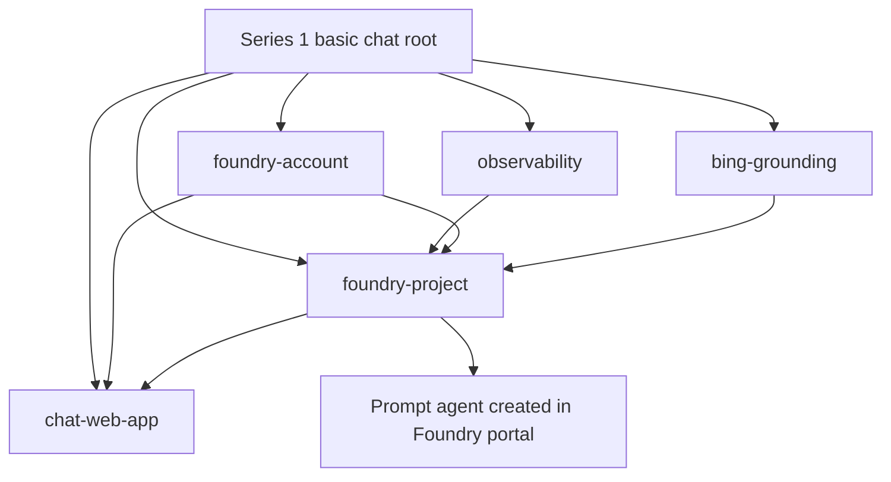

# Terraform Module Architecture

## Scope

Series 1 contains one independently deployable environment: the basic Microsoft Foundry chat proof of concept. Later environments, including the production baseline and hosted agents, belong in later series and are not part of this initial implementation.

The environment is a Terraform root module. Reusable child modules are kept separately under `modules/`, and the root composes them by passing values through module inputs and outputs. Child modules do not call each other. This keeps the dependency graph visible in one place and makes each module easier to reuse.

## Proposed repository layout

```text
environments/
└── series-1/
    └── basic-chat/
        ├── README.md
        ├── backend.tf
        ├── providers.tf
        ├── main.tf
        ├── variables.tf
        ├── outputs.tf
        └── terraform.tfvars.example
modules/
├── observability/
├── foundry-account/
├── bing-grounding/
├── foundry-project/
└── chat-web-app/
docs/
├── architecture/
├── decisions/
└── terraform-module-architecture.md
```

The architecture and decision subdirectories will be added when their first files are introduced. Do not create environment directories for future series until those implementations are in scope.

## Series 1 module responsibilities

| Module | Responsibility |
| --- | --- |
| `observability` | Log Analytics workspace and Application Insights resource, including diagnostic settings needed by the sample. |
| `foundry-account` | Foundry account, the sample model deployment, account diagnostics, and the portal user's required role assignment. |
| `bing-grounding` | Bing Grounding resource used by the prompt agent. |
| `foundry-project` | Foundry project, project identity, and project connections to Bing grounding and Application Insights. |
| `chat-web-app` | User-assigned managed identity, App Service plan and web app, application settings, diagnostics, and the identity's Foundry access assignment. |

The environment root creates or accepts the resource group, declares the Azure providers, wires module outputs into dependent module inputs, and exposes useful deployment outputs. It owns the state backend configuration but contains no service implementation details beyond the top-level composition.

The sample's prompt agent is created separately through the Foundry portal as described by the upstream walkthrough. Terraform deploys the infrastructure and project connections required by that agent; it does not claim to manage the agent definition in this first environment.

## Composition



## Terraform conventions

- Treat each environment directory as a separate root module and state boundary. Use a unique remote state key for this environment; do not use Terraform CLI workspaces to represent later architectures.
- Keep provider configuration and provider version constraints in the root. Pin provider versions and commit the environment's `.terraform.lock.hcl`.
- Keep reusable modules focused on cohesive capabilities rather than mirroring every Bicep file or making a module for each individual resource.
- Give each reusable module `main.tf`, `variables.tf`, `outputs.tf`, and a README describing its contract and use. Document every public variable and output.
- Pass credentials through the Azure provider's supported identity mechanisms or secure pipeline variables. Do not put secrets in `.tf`, `.tfvars`, backend configuration committed to Git, or Terraform outputs.
- Keep a tracked `terraform.tfvars.example` with non-sensitive sample values. Supply state backend settings out of band.
- Use Azure Verified Modules when a maintained module fits a standard Azure capability. Keep the Foundry-specific composition in this repository.
- Prefer AzureRM resources when they cover the required resource/API version. Use AzAPI for Foundry or connection resources that the pinned AzureRM provider does not yet support, and document the API version and any preview dependency.

## State and deployment boundary

The Series 1 root should deploy into one subscription and region. It should own or explicitly target one resource group and use a remote Azure Storage backend with a distinct key such as `series-1/basic-chat.tfstate`. The backend storage account and container are bootstrapped separately so Terraform can initialise before managing the workload.

Plan and apply only from `environments/series-1/basic-chat`. The environment README will document prerequisites, identity and role requirements, deployment steps, expected outputs, and cleanup. Later series environments will have separate roots and state keys, so a viewer can deploy and remove this proof of concept without affecting later architectures.
